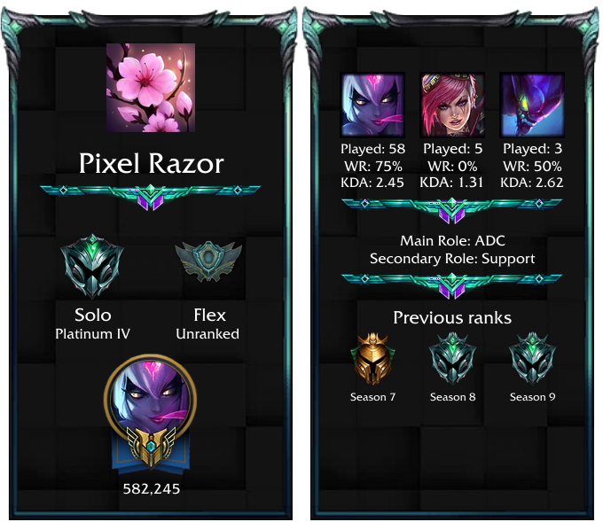
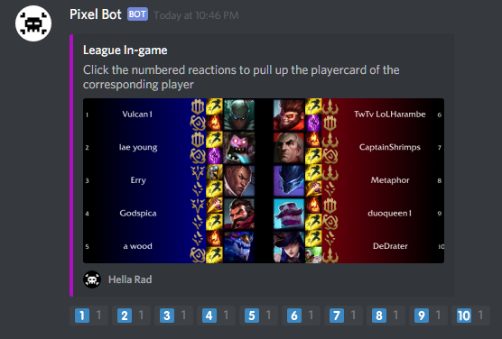

# Pixel Bot
Pixel Bot is my own Discord Bot project. More documentation will be added as the project progresses. If you have any suggestions, you can email me [here](mailto:pixelrazor@gmail.com). 

If you like my bot and/or would like to support me, please consider [buying me a coffee](#coffee)!

# Invite Link
If you'd like to have Pixel Bot in your server, just visit [this](https://discordapp.com/oauth2/authorize?client_id=394239904231718912&scope=bot&permissions=191488) link.

# Commands
Commands can be in one of two formats
> \/\<command\> \<arguments\>

or
> @pixelbot \<command\> \<argument\>

In the second format, the mention can be added __anywhere__ in the message (**\<command\> @pixelbot \<args\>**)
# Features
- [League of Legends](#league)
    - [x] [Playercards](#lcard)
    - [x] [In-game cards](#lingame)
- [Fortnite](#fortnite)
    - [ ] [Something with player stats?](#fstats)
- [Dota 2](#dota2)
- [Heroes of The Storm](#hots)
- [Battlerite](#brite)
- [Overwatch](#owatch)
- [CS:GO](csgo)
# League of Legends
The league commands can be view via the **\/league help** command. The supported regions are na, br, eune, euw, jp, kr, lan, las, oce, tr, and ru.
## League Playercards
Playercards can be created using the following command:
>\/league \<reigion\> player \<summoner\>

Where region is the corresponsing region (NA by default, see the league help menu for others)

A custom quote can be added to the card after verifying via the 'code' and 'verify' commands. Please see the league help menu for more details.

Here's a sample playercard the the bot generated:

## In-game cards 
You can pull up an image showing the teams of the current match for the specified summoner. Reacts will be added, and each one corresponds to a player from that match. Clicking a react will generate the playercard for the corresponding player:
>\/league \<reigion\> match \<summoner\>

Here's an example of what this looks like:

# Fornite
Under construction
## Something with player stats?
Under construction. Probably up next
# Dota 2
Under construction
# Heroes of The Storm
Under construction
# Battlerite
Under construction
# Overwatch
Under construction
# CS:GO
Under construction
# Support Me

